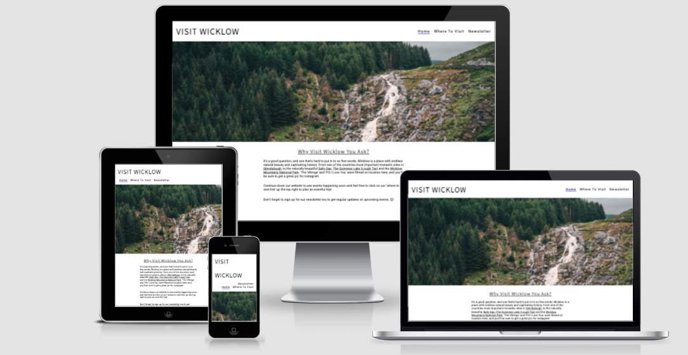
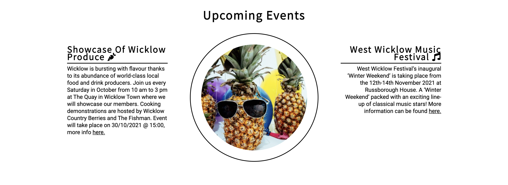
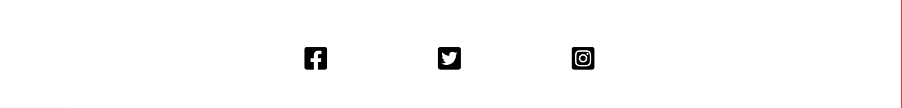
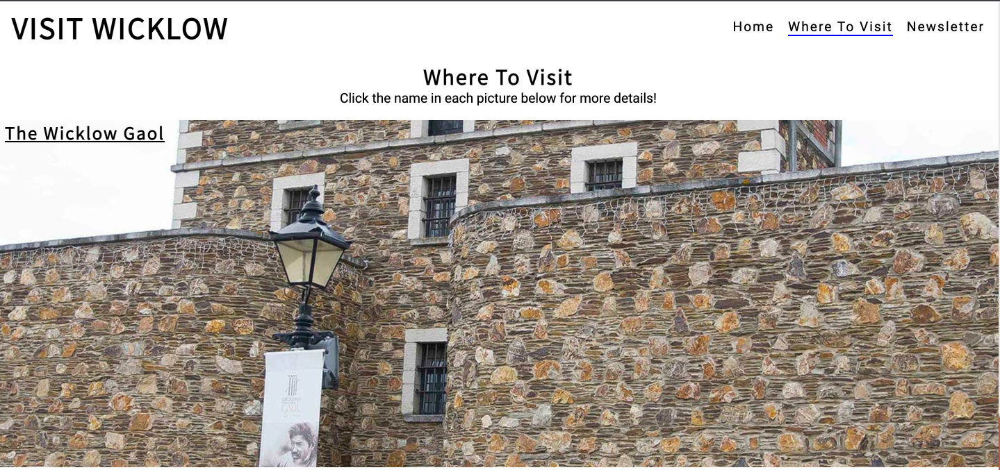
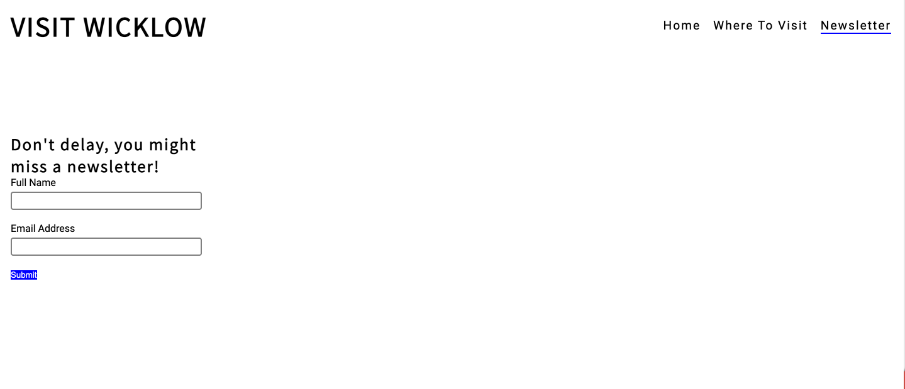
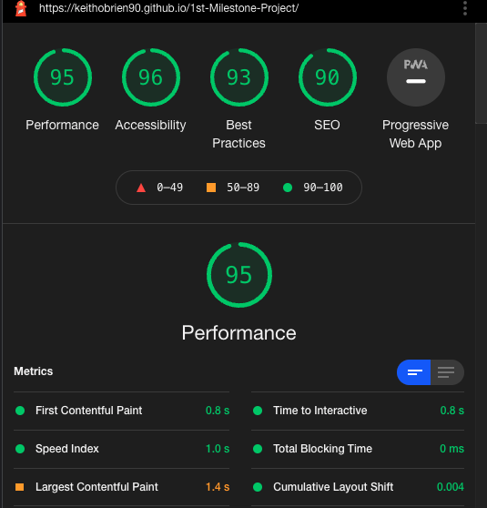

<h1>Vist Wicklow</h1>

Welcome! to the greatest county in Ireland!

Visit Wicklow website is a landing page for both local tourists going on a staycation and those coming in from abroad as Covid restrictions ease, with the aim of increaseing local tourism.

Users of this website will be able to find plenty of wonderful things to attract themn to wicklow, and will have the oppurtunity to sign up to a newsletter to keep an eye on upcoming events.]

**Features**
**Existing features**

**Navigation bar**
- Featured on all three pages, the navigation bar is fully responsive and includes links to home, areas of interest to vist and a form to sign up for a newsletter.
- This section easily allows users to navigate across all pages of the site on all devices.

**The Landing Page**
- I tried to keep the landing page as clean and as easy to read as possible, with such a wide target audience i think this is best suited to appease to most. It includes a large photopragh which I believe captures wicklows stunning beauty and should cature their eye.

**Why visit Wicklow section**
- Again, i kept this simple and clean so it's easy to read.
- It details some of Wicklows most popular natural tourist attractions, which are easily clickable and show where each are located within the county, easyfor those who are looking to visit an area on the back of reading this section.

**Upcoming events section**
- This section is styled simply again, with two sections to the left and right both providing information on a seperate upcoming event and an external hyper link to more information for anyone interested after reading.
- Seperated by an image from pexel, more out there than any other image on the page but it represents a party (event) in a fun way nd should capture attention.

**The Footer**
- The footer simply includes likes to social media sites for Visit Wicklow, with the links opening a new tab to allow easy navigation and keep them on our site too.

**Where to visit**
- I have selected three lesser visited areas than those mentioned in my 'Why visit Wicklow section' with the aim to bring more tourists to these areas whilst they are in the county.
- I styled the backround of each section on this page with a lrage background image as to grab the attention of those looking, with the title on each image leading to a webpage withg more information on each attraction.
- This section is valuable to the visiter as they are easily able to identify each of the three attractions and easily get more information, whilst still staying on site, so they can fo back and forward between the three attractions.

**The Newsletter page**
-In keeping in line with the rest of the site i kept this clean and simple, it contains a simple form and a submit button to sign up to our newsletter.

**Color used**
-So i kept it cleen with all white behind text on the landing page and black text, with menu navigation highlighted blue when the mouse hovers over it. This is the reoccuring color theme throughout the website.

**Testing**
- Tested this page works in different browsers such as firefox, chrome & safari, tested on iPad and iPhone too.
- I tested the navigation on all portals and devices mentioned above and worked well, tested signup for newsletter to to ensure it asked for name & email as requirement.
-I tested all hyperlinks to external sites which work perfect.

**bugs**

-After first deployment, spacing was not correct between the why wicklow section and events section, causing an overlap on the phone.
-adjusted margin setting in section on style.cc sheet for screens below 450 px to a percentage as opposed to fixed pixels and issue resolved.

**Validator testing**
**HTML**
- Errors found where that of duplicate ID being used throughout project.
**CSS**
- No errors found
**Accesibility**
- I confirmed that the site was easily accesible and that colors and fonts chosing easy to read, i used lighthouse in devtools to confirm.

**Unfixed bugs**
-No unfixed bugs

**Deployment**
-This site was deplyed to GitHub pages.
-The steps to do so where; navigate to settings in repository, from source section menu select master branch, once selected the page provided the link to the completed website.

Live link can be found here - https://keithobrien90.github.io/1st-Milestone-Project/ 

**Credits**

**Content**
-The code to make the event style was taken from the code institutes love running project, along with @media content in style.css sheet which helped responsiveness on different browser sizes.

**Media**
-Image in header and in event section taken from https://www.pexels.com/

-Images in 'where to visit' taken from https://www.wicklowshistoricgaol.com/ , https://victorsway.eu/ , https://www.bray.ie/ , respectively..

-Font icons taken from https://fontawesome.com/v5.15/icons 

-Fonts taken from google fonts.

